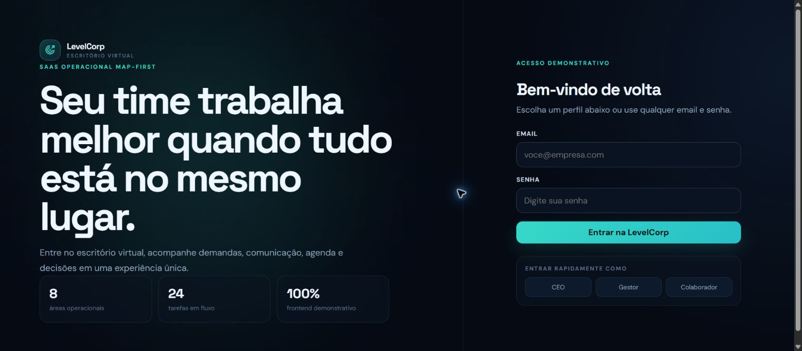

# LevelCorp Frontend Demo

Versao estatica e independente da LevelCorp para demonstracoes rapidas.

## Screenshot

## Caracteristicas

- Sem backend.
- Sem banco.
- Sem APIs externas.
- Sem variaveis de ambiente.
- Login e dados mockados no navegador.
- Pronta para Vercel como projeto estatico.

## Executar localmente

Abra `index.html` diretamente no navegador.

Atalhos diretos:

- `https://seu-projeto.vercel.app/?role=ceo`
- `https://seu-projeto.vercel.app/?role=gestor`
- `https://seu-projeto.vercel.app/?role=colaborador`
- `https://seu-projeto.vercel.app/?role=ceo&page=map`

## Deploy na Vercel

1. Envie esta pasta para o GitHub.
2. Importe o repositorio na Vercel.
3. Como este repositorio ja contem a demo na raiz, mantenha Root Directory vazio.
4. Framework Preset: `Other`.
5. Build Command: vazio.
6. Output Directory: vazio.
7. Install Command: vazio.
8. Clique em Deploy.

A Vercel publica `index.html`, `styles.css` e `app.js` diretamente. Nao existe
servidor ou Serverless Function nesta versao.

Nenhuma variavel de ambiente e necessaria.

## Aviso

Esta versao e somente demonstrativa. Alteracoes ficam apenas no navegador e
podem ser perdidas ao limpar o armazenamento local.
