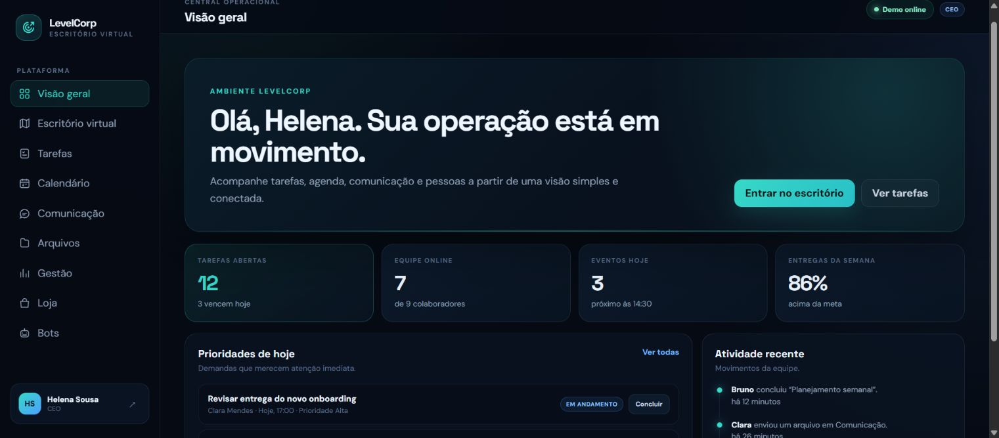
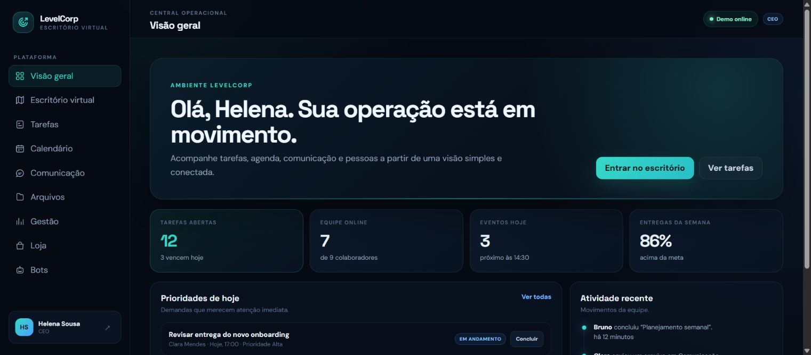

# LevelCorp Frontend Demo

Versão estática e independente da LevelCorp para demonstrações rápidas.

## Capturas de tela

| Login | Dashboard CEO |
| --- | --- |
|  |  |

| Dashboard Gestor | Dashboard Colaborador |
| --- | --- |
|  |  |

## Características

- Sem backend.
- Sem banco.
- Sem APIs externas.
- Sem variáveis de ambiente.
- Login e dados mockados no navegador.
- Pronta para Vercel como projeto estático.

## Executar localmente

Abra `index.html` diretamente no navegador.

Atalhos diretos:

- `https://seu-projeto.vercel.app/?role=ceo`
- `https://seu-projeto.vercel.app/?role=gestor`
- `https://seu-projeto.vercel.app/?role=colaborador`
- `https://seu-projeto.vercel.app/?role=ceo&page=map`

## Deploy na Vercel

1. Envie esta pasta para o GitHub.
2. Importe o repositório na Vercel.
3. Como este repositório já contém a demo na raiz, mantenha Root Directory vazio.
4. Framework Preset: `Other`.
5. Build Command: vazio.
6. Output Directory: vazio.
7. Install Command: vazio.
8. Clique em Deploy.

A Vercel publica `index.html`, `styles.css` e `app.js` diretamente. Não existe
servidor ou Serverless Function nesta versão.

Nenhuma variável de ambiente é necessária.

## Aviso

Esta versão é somente demonstrativa. Alterações ficam apenas no navegador e
podem ser perdidas ao limpar o armazenamento local.
